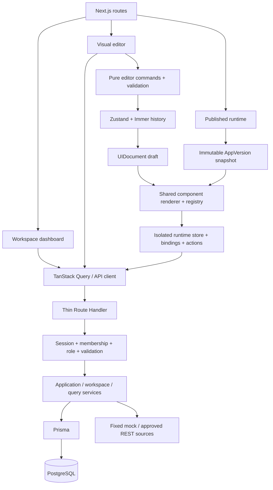
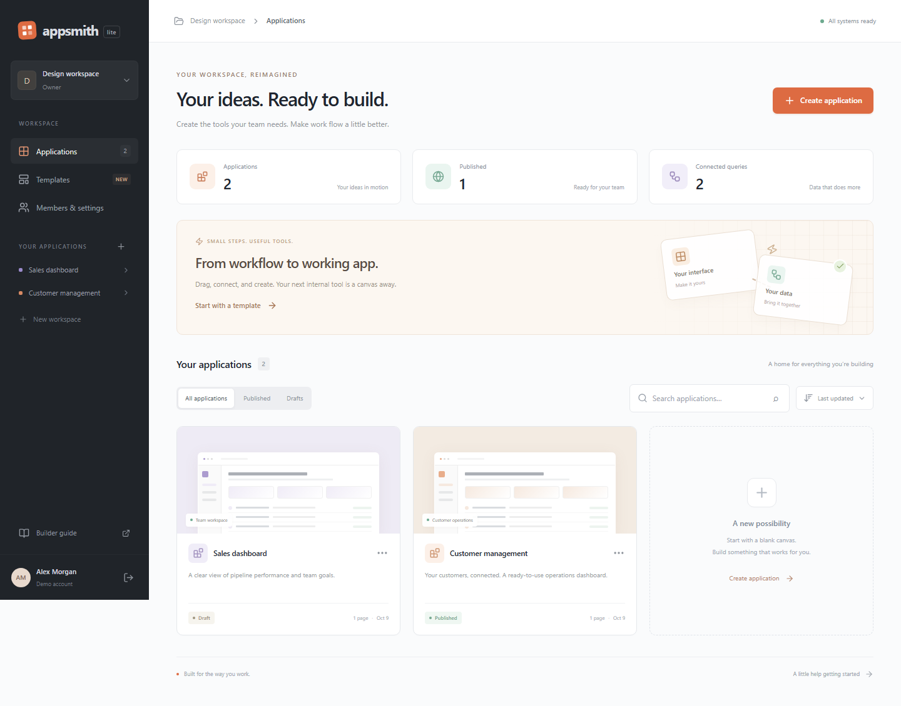
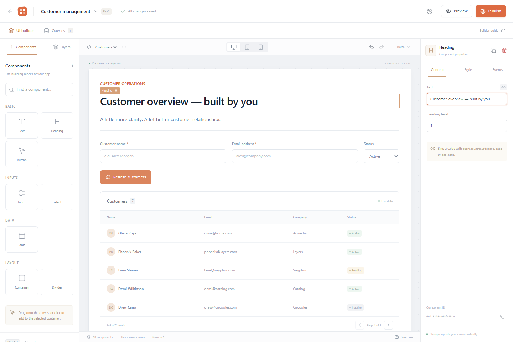

# AppSmith Lite

A visual builder for the internal tools your team actually needs. Built with Next.js App Router, React, TypeScript, PostgreSQL and Prisma.

Create a workspace, assemble an interface from components, connect a query, and publish an independent application snapshot. The **Explore the demo workspace** button creates an isolated account with a working customer dashboard. No seed or manual configuration is needed after starting the database.

## Quick start

Requires Node.js 24+, npm and Docker Compose (or an existing PostgreSQL database).

```sh
npm ci
```

Copy `.env.example` to `.env` (`Copy-Item .env.example .env` in PowerShell, `cp .env.example .env` on macOS/Linux). Then:

```sh
docker compose up -d
npm run db:generate
npm run db:migrate
npm run dev
```

Open **http://127.0.0.1:3000** and choose **Explore the demo workspace**, or create your own account. The database listens only on `127.0.0.1:54329` and persists in a named Docker volume. `docker compose down` stops the database without deleting data.

For an existing PostgreSQL instance, set `DATABASE_URL` and skip `docker compose up`. In Windows, stop the Next.js server before regenerating the Prisma client: the running process locks its native query engine.

## What you can build

- Multiple workspaces with Owner, Editor and Viewer memberships. Owners add existing registered users by email and assign roles; no invitation email is sent.
- Application creation, rename, duplicate, search, status filters, date sorting and deletion. The customer management template includes live mock data.
- Multiple pages with a normalized component tree. Container, Heading, Text, Button, Input, Select, Table and Divider are available.
- Click-to-add and nested drag-and-drop, selected-node property editing, layer ordering, subtree duplication, copy/paste and a 50-operation Undo/Redo history.
- Schema-based Content, Style and Events inspectors; selection and viewport settings remain outside document history.
- Debounced autosave, local draft recovery, optimistic revisions, visible conflict handling and a draft download before recovery.
- Separate query configurations, source configurations and runtime results. Approved mock data and JSONPlaceholder GET/POST requests, headers, parameters, JSON bodies, request testing and response inspection.
- Declarative bindings, latest-input request bodies, table row selection and registered actions (query, toast, navigation, set value, reset inputs).
- Desktop/tablet/mobile canvas widths, an interactive draft preview, immutable publication history and a protected published runtime.
- A responsive workspace dashboard, loading/empty/error states, Radix dialogs/menus, a built-in builder guide, keyboard shortcuts and windowed rendering for large unpaginated tables.

## Typical workflow

1. Enter a demo workspace and open **Customer management**.
2. Select the heading; change its text in the inspector.
3. Add a container, then drag a component inside it. Adjust direction, spacing and padding under Style.
4. Open Queries. Test `getCustomers`, or create a JSONPlaceholder `users` request.
5. Select a table and bind Data to `queries.getUsers.data`; set columns to `["name", "email", "phone"]`.
6. Select a button, open Events, and choose **Run query**.
7. Open Preview to use inputs, select rows and trigger actions.
8. Publish and open the resulting URL. Only authenticated workspace members can access it.
9. Edit the draft again. The published version remains unchanged until another publication.

## Bindings and actions

Bindings are data, never JavaScript:

```json
{ "kind": "binding", "path": "queries.getCustomers.data" }
```

Allowed roots are `app`, `queries`, `state` and `inputs`. Examples:

| Binding                            | Use                      |
| ---------------------------------- | ------------------------ |
| `app.name`                         | Dynamic heading or label |
| `queries.getCustomers.data`        | Table rows               |
| `queries.createCustomer.isLoading` | Disabled button          |
| `state.selectedRow.email`          | A selected table row     |
| `inputs.COMPONENT_ID.value`        | An input's current value |

Copy an input's ID at the bottom of the inspector. In a POST query body, map a named field to that input:

```json
{
  "name": { "kind": "binding", "path": "inputs.COMPONENT_ID.value" },
  "email": { "kind": "binding", "path": "inputs.EMAIL_COMPONENT_ID.value" }
}
```

Top-level body values resolve against the current runtime context before the request. A POST button checks the visible inputs' native required/email validation. GET actions do not require unrelated fields. Defaults are registered in runtime state; reset restores those defaults. `onChange` actions read the new input value and `onRowSelect` actions read the newly selected row.

Missing bindings resolve to `undefined` and render an empty value or table. Incompatible types show a component-level error. Prototype traversal is rejected. There is no expression language or computed-binding graph in this MVP.

Mock GET returns the sample customer directory. Mock POST returns a simulated created record; it does not persist a business record. JSONPlaceholder POST is also a public test API and does not durably create real records. App documents, query configuration, accounts and versions are durably stored in PostgreSQL.

## Architecture



- `src/app`: route composition, server-side page access guards, providers and styles.
- `src/entities`: document types and structural validation.
- `src/features`: authentication, dashboard, registry, editor, bindings, actions, queries and runtime.
- `src/server`: session provider, authorization, services, limits and Prisma client.
- `src/shared`: UI primitives, API client and demo fixtures.
- `prisma`: schema, initial migration and optional owner seed.
- `src/tests`: unit, component and browser/API integration tests.

`Page.document` is the editable draft. Saving compares `expectedRevision` in an atomic update and increments the revision. A mismatch returns `409 REVISION_CONFLICT`; the second tab cannot silently overwrite the first tab's save.

Publishing locks the application row in a transaction, reads its pages and queries, validates a snapshot, allocates a monotonically increasing version number and changes the active version pointer. Published query execution loads configurations from that snapshot, including queries later edited or deleted in the draft. Duplication assigns new page/query IDs and rewrites navigation/query event references.

The editor renderer adds selection, drag handles and drop slots around the shared `NodeContent`. `RuntimeRenderer` has no imports from the editor. Component input edits subscribe to their own state; independent components do not render again. A request counter prevents an older response from replacing a newer result. Tables paginate by default; unpaginated datasets over 100 rows use a visible row window.

## Access policy and security

| Operation                                   | Owner | Editor | Viewer |
| ------------------------------------------- | ----- | ------ | ------ |
| Open published app / run published query    | Yes   | Yes    | Yes    |
| Read/edit drafts, pages and queries         | Yes   | Yes    | No     |
| Create/duplicate/rename/delete applications | Yes   | Yes    | No     |
| Publish                                     | Yes   | No     | No     |
| Manage workspace and memberships            | Yes   | No     | No     |

All API actions check a database session and resource membership; browser controls are not the authorization boundary. Sessions use random opaque tokens, hashed token storage, httpOnly/SameSite cookies, seven-day expiry and server-side revocation on logout. Passwords use salted scrypt. There are no hardcoded account credentials.

The query executor constructs a fixed HTTPS origin and one of three literal JSONPlaceholder paths. No user URL, port, redirect, private network address or authentication header is accepted. Only Accept and Content-Type headers are supported and validated before storage. Requests have an eight-second timeout, responses are streamed with a 1 MB limit, documents are capped at 500 KB / 500 nodes / 20 levels, and request bodies at 600 KB. Origin checks and security headers are configured. User content renders as escaped React text; no `eval`, `new Function` or unsafe HTML is used.

Rate limits are per server process (auth, API and query execution). Use a shared rate-limit store and trusted proxy configuration before running multiple production replicas. CSP permits inline scripts required by this Next.js build; a nonce-based policy can tighten this in a later release.

## Checks

```sh
npm run lint
npm run typecheck
npm test
npm run build
npx playwright install chromium
npm run test:e2e
npm audit
```

Browser tests require a migrated PostgreSQL database and a local server at `127.0.0.1:3000` (Playwright starts one if needed). They create isolated disposable test accounts and clean up only those accounts' workspaces. The REST integration test needs internet access to JSONPlaceholder.

Coverage includes tree invariants, all editor commands, history, binding safety, inspector editing, canvas selection, runtime actions, input isolation, request body bindings, registration/login/logout, multi-page persistence, real pointer dragging, publication isolation, workspace access, Viewer restrictions, actual REST GET/POST, a two-tab revision conflict and a mobile dashboard.

GitHub Actions runs lint, types, tests, build and Playwright against a PostgreSQL service. `deepmerge-ts` is overridden to its fixed v8 release; Prisma client generation and migrations are checked with the override. Versions are locked in `package-lock.json`.

## Production

```sh
npm ci
npm run db:generate
npm run db:migrate
npm run build
npm start
```

Set `DATABASE_URL` to a durable PostgreSQL instance and `APP_ORIGIN` to the exact HTTPS origin. Production session cookies are Secure, so serve the app behind TLS. Run migrations as a release step before starting the server. A container build is provided:

```sh
docker build -t appsmith-lite .
docker run --env-file .env.production -p 127.0.0.1:3000:3000 appsmith-lite
```

Create `.env.production` with your database URL and HTTPS origin. The container exposes its app internally on port 3000; configure your own TLS reverse proxy. No public hosting account or remote deployment is configured automatically.

An optional persistent owner seed reads `SEED_EMAIL` and `SEED_PASSWORD` (minimum eight characters) from the environment: `npm run db:seed`. The demo button requires no seed. Demo accounts persist in the local database; there is no automatic expiry cleanup yet.

## Deliberate MVP boundaries

Chart and Form components, OAuth, invitations by email, arbitrary API origins, secrets storage, collaborative editing, expressions, anonymous public links and external plugins are outside this MVP. The editor is optimized for desktop screens; the workspace dashboard and published applications adapt to phones. The mock source is a test fixture, not a customer database. There is no automatic business-data mutation, version rollback UI or cloud deployment.

The complete original specification is preserved in `specification.md`.

## Portfolio artifacts





The short recorded walkthrough is in [demo.webm](demo.webm). It demonstrates editing, data requests, preview, publishing and runtime pagination. To refresh the screenshots and recording, run `RECORD_DEMO=1 npx playwright test portfolio.spec.ts` (PowerShell: `$env:RECORD_DEMO='1'; npx playwright test portfolio.spec.ts`). This optional recording test is skipped in normal CI.
